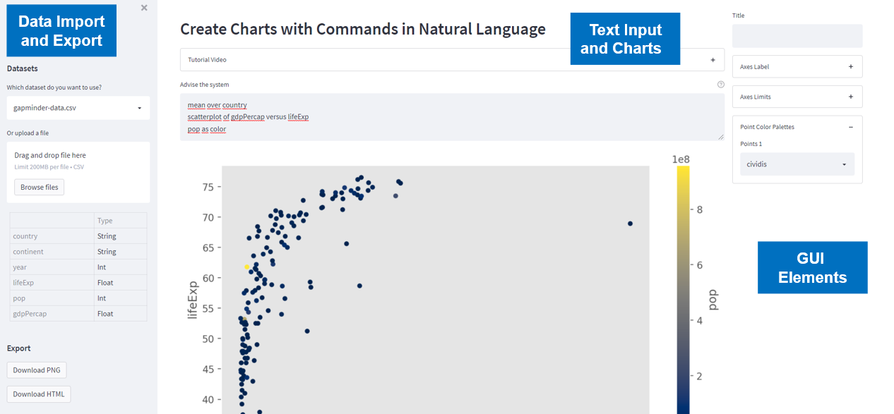
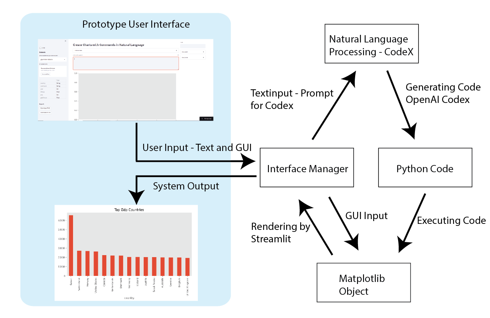

# NLP2Chart — Information Visualization in Natural Language -Part 2
## An application to create charts with commands in natural language using CodeX

## Architecture of the Application

The prototype is realized as a web application with Python. The framework ”Streamlit” is used.

Start with "streamlit run main.py"

Data can be processed in CSV format and exported as PNG or HTML. The following chart shows the system architecture using CodeX for code generation.

## GPT3 API
You need an GPT3 API key from https://openai.com/api/

## Blog Articles and Youtube

https://towardsdatascience.com/nlp2chart-information-visualization-in-natural-language-part-2-a325c5e636dc

https://towardsdatascience.com/nlp2chart-9bc732719ba0

https://www.youtube.com/watch?v=UiCSczhslAs

https://www.youtube.com/watch?v=cRrwU_VNEKQ&t=2s

## Citation

The work was presented at the 26th International Conference Information Visualisation (IV) on 19–22 July 2022 at the “Technische Universität Wien, Austria” and the paper appears in the conference publications.

@software{Stockl_Natural_Language_Interface_2022,
author = {Stöckl, Andreas},
doi = {10.1109/IV56949.2022.00031},
month = {7},
title = {{Natural Language Interface for Data Visualization with Deep Learning Based Language Models}},
url = {https://github.com/astoeckl/NLP2Chart2},
version = {1.0.0},
year = {2022}
}

The paper will be soon available at IEEE Xplore Digital Library https://ieeexplore.ieee.org/xpl/conhome/1000370/all-proceedings
